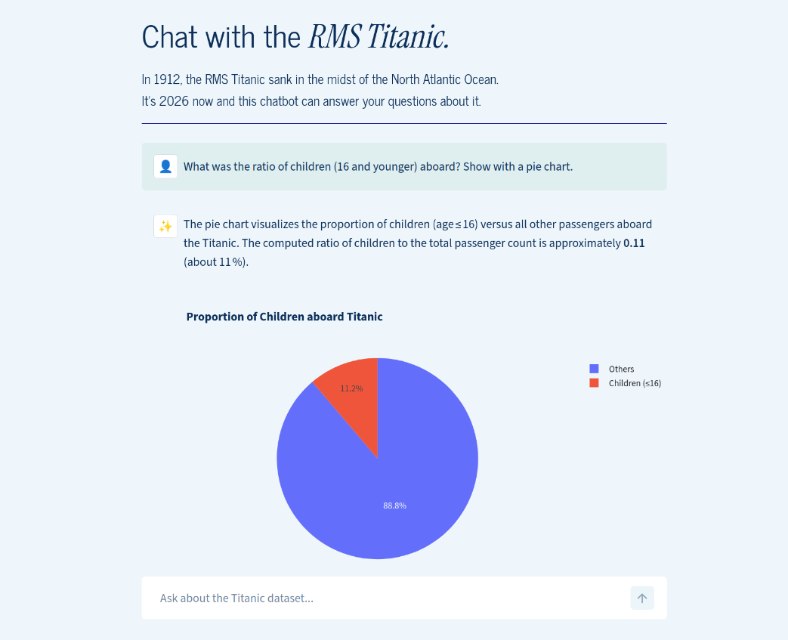

# Titanic Analysis Chatbot 🚢

LLM-powered Chatbot that allows users to explore and visualize the Titanic dataset using natural language. Built using FastAPI, Streamlit and a LangChain Agent.

<div align="center">

**[Project Overview](#1-project-overview) &nbsp;•&nbsp; [Technical Architecture](#2-technical-details) &nbsp;•&nbsp; [Local Setup](#3-local-setup)**

</div>

<p align="center">
  
</p>


---

## 1. Project Overview

- ⚙️ **Backend:** A FastAPI server hosting a LangChain-powered agent.
- 🛠️ **Agent Capabilities:** The agent uses a ReAct (Reasoning and Acting) loop to decide between performing data computations (using Pandas) or generating visualizations (using Plotly).
- 📊 **Dynamic Visualization:** Charts are generated as Plotly objects on the backend, serialized and sent via the API, and rendered natively by Streamlit using Plotly.
- 🖥️ **Frontend:** A Streamlit application that maintains the chat session and utilizes the backend API for responses.
- 📁 **Dataset:** Uses the [Titanic Dataset](https://raw.githubusercontent.com/datasciencedojo/datasets/refs/heads/master/titanic.csv) (automatically downloaded and saved on first boot).

### API Specification

| Method | Route | Description | Auth |
| :----- | :----------- | :----------------------------------------- | :---- |
| `POST` | `/api/chat` | Processes user query and returns text + plot artifact. | Bearer Token |

---

## 2. Technical Details

### Chatbot Agent / Tools
The system utilizes a [LangChain "ReAct" Agent](https://docs.langchain.com/oss/python/langchain/agents/) with access to two specialized tools:
- **`python_data_tool`**: Allows the model to execute Pandas queries in an `exec` with the included Titanic dataframe. The result of the computation is returned to the model as a string.

- **`python_plot_tool`**:  Allows the model to generate code for making a Plotly `Figure` object inside an `exec`, which it then assigns to a specified variable. The tool then extracts this object and serializes it into JSON to be saved as a *tool artifact*. The model gets a confirmation if the plot generation was successful.

After the ReAct loop is completed, the system returns the final output message in the API response, along with the serialized plot, if any, to be rendered on the frontend.

### Memory & Persistence
- Streamlit `session_id` is used to maintain chat context and is mapped to the `thread_id` of the agent's checkpointer.
- **Persistence:** The agent uses a checkpointer (`AsyncSqliteSaver`) to store agent history in a SQLite database, allowing it to maintain context across API calls for the same chat.

### Security & Infrastructure
- The API is protected via Bearer Token authentication. Additionally, the frontend requires a specific URL query parameter to prevent unauthorized public access to the demo.
- The backend is containerized with Docker for providing a basic layer of security against the Remote Code Execution (RCE) risk from LLM code-generation.
- Logging is set up to record user queries, agent tool-calls, and system errors to log files in a Docker volume.

---

## 3. Local Setup

### Backend (using Docker)
1. Navigate to the `backend/` directory.
2. Copy `.env.example` into `.env` and fill in your values.
   ```env
   API_TOKEN=your_secure_token
   OPENAI_API_KEY=your_provider_api_key
   OPENAI_API_BASE=https://api.yourprovider.com/v1 
   MODEL_NAME=your_model_choice
   ```
3. Run with Docker Compose:
   ```bash
   docker compose up --build
   ```

### Frontend (using `venv`)
1. Navigate to the `frontend/` directory.
2. Create a virtual environment and install requirements:
   ```bash
   python3 -m venv venv
   source venv/bin/activate
   pip install -r requirements.txt
   ```
3. Copy `.streamlit/secrets.toml.example` into `.streamlit/secrets.toml` and fill in your values.
   ```toml
   API_URL = "http://localhost:8900/api/chat"
   API_TOKEN = "your_secure_token"
   ```
4. Run the Streamlit app:
   ```bash
   streamlit run app.py
   ```

---


